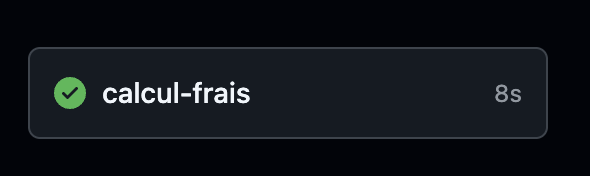

# Calcul des frais de salles Buyanga

La troupe Buyanga est amenée à répéter dans différentes salles qui doivent être payées à la fin de chaque mois. Ce dépôt permet de calculer automatiquement ce qui doit être payé à chaque salle ainsi que la part de chaque membre de la troupe en se basant sur l'agenda Google partagé afin d'éviter des erreurs de calcul.

**Important** : le calcul prend en compte tous les évènements de l'agenda qui ont le mot `Répétition` dans le nom. **Il ne faut donc pas oublier de l'indiquer sinon la répétition ne sera pas prise en compte dans les calculs.** Il utilise ensuite le lieu indiqué dans l'évènement pour déterminer la salle correspondante

## Lancement du calcul

Le projet est configuré pour pouvoir être exécuté depuis une action GitHub.

Pour lancer un calcul il faut aller dans le menu `Actions` (1), cliquer sur `Lancer le calcul des frais`(2), cliquer sur le bouton `Run workflow` (3) puis enfin choisir si on veut lancer le calcul pour le mois courant ou le précédent et cliquer sur le bouton `Run workflow` (4) :

Au bout de quelques secondes, les traitements vont se lancer et une nouvelle ligne apparaitra dans le tableau. Pour consulter le résultat il faudra cliquer sur la ligne qui vient d'apparaitre puis sur l'action `calcul-frais` :
| La nouvelle ligne | | L'action |
:-:|:-:|:-:
|  | ➡️ |  |

Il faut ensuite cliquer sur la petite flèche à gauche de la ligne `Exécution du calcul de frais` pour dérouler le résultat du calcul :

Celui-ci se divise en 2 partie :
1. Une première section donne le détail des répétitions salle par salle et permet de vérifier si les salles de toutes les répétitions ont été identifiées (message sur fond vert) ou non (message sur fond rouge)
2. Une seconde section avec directement le message qui peut être partagé sur Whatsapp avec le formattage correpondant

## Configuration des paramètres de calcul

Certains paramètres de calculs ont été prévus pour être configurables. Pour modifier les valeurs, il faut aller dans le menu `Settings` (1) puis dans `Secrets and variables` (2), cliquer sur l'onglet Variables (3) et enfin sur le crayon correspondant au paramètre à modifier (4) :

### Nombre de personnes

La variable `MEMBRES_PAYANTS` permet d'indiquer combien de personnes participent au règlement des salles de répétition.

### Tarifs des salles

La variable `SALLES_JSON` est un tableau structuré au format JSON qui permet de définir le tarif appliqué par chacune des salles. Si le nom des salles ne doit pas être modifié ici (car le code se base sur ces informations pour faire la correspondance), il est possible d'indiquer pour chacune d'entre elles un tarif horaire (`pricePerHour`) ou un tarif au créneau (`pricePerEvent`).
